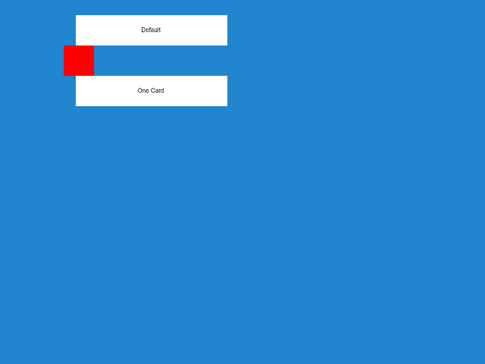
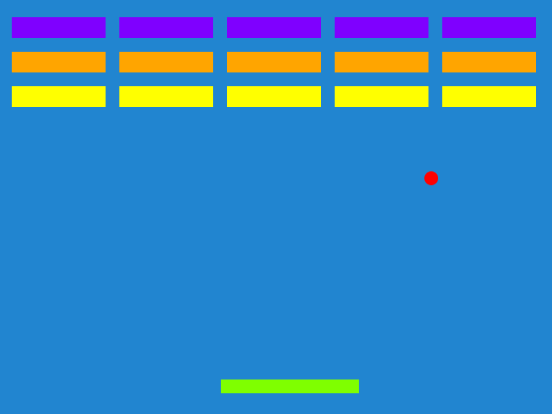
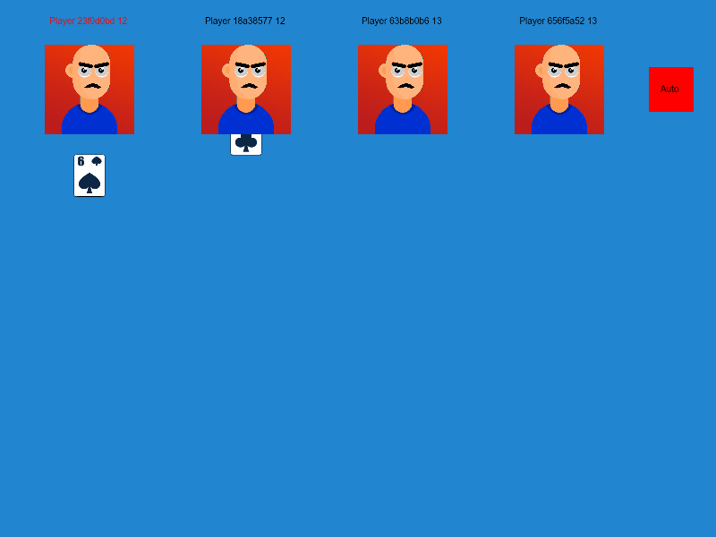
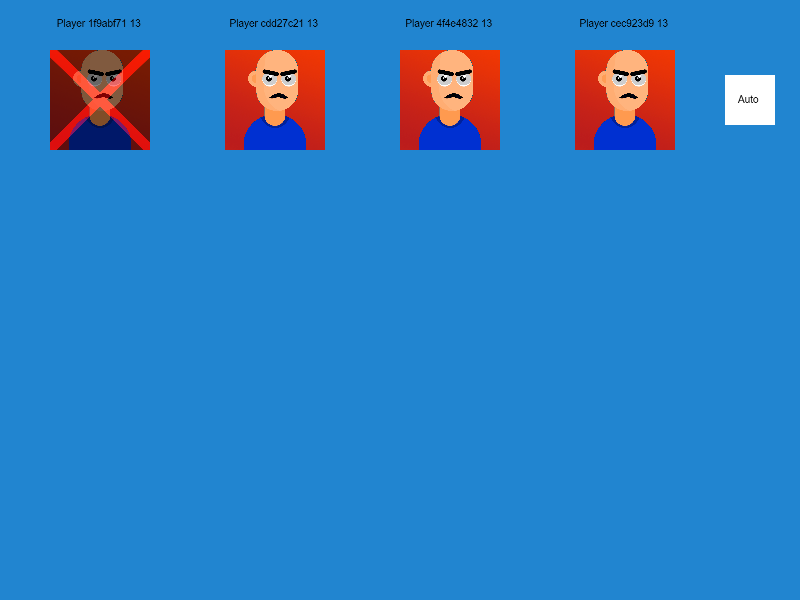

# Test-Game

**[▶ Play it in the browser](https://dimitriuses.github.io/Test-Game/)**

[](https://github.com/Dimitriuses/Test-Game/actions/workflows/pages.yml)


A sandbox I built in August 2024 to learn the [Excalibur.js](https://excaliburjs.com)
game engine. It holds two small games behind a menu: a **Breakout** clone, and **One Card**,
a four-player "high card wins" game with a deck of animated sprites and an auto-play mode.
It was written to try out the engine's scenes, actors, action sequences, timers and
pointer input, not to be a finished product — and it isn't one. What is here works;
what is missing is described honestly below.

| Menu | Breakout | One Card |
|---|---|---|
|  |  |  |

## Controls

Everything is mouse-driven — there are no keyboard controls.

| Where | What to do |
|---|---|
| Menu | Click **Default** for Breakout, **One Card** for the card game |
| Breakout | Move the mouse to slide the paddle. Clear all 15 bricks to win; let the ball fall off the bottom to lose. Click **OK** on the banner to return to the menu |
| One Card | Click the **deck** (bottom left) to deal the whole deck out to the four players, then click **Auto** (top right) to let the game play itself — each tick two neighbouring players turn a card and the higher one takes both |

The first click anywhere on the canvas dismisses Excalibur's loading screen; the One Card
scene loads 68 images when you enter it, so it takes a moment the first time.

## Status and history

Written in one evening: the whole committed history runs from 20:20 on 2024-08-26 to
01:33 on 2024-08-27, four commits. Metadata inside one of the card images shows I had been
poking at it in GIMP as early as 2024-05-06, so the idea sat around for a few months
before the evening it got built.

**It runs, and it always did.** That is worth saying because most of the other archived
repositories in this account do not. Both games are playable start to finish today on
Node 22 with the original toolchain.

What was *not* finished, and is visible if you play it:

- **One Card has no end.** Nothing checks for a winner. A player who runs out of cards
  gets a red cross drawn over them, and that is the entire endgame.
- **Clicking a player does the wrong thing.** The handler that was supposed to make a
  player turn a card is commented out, and what runs instead draws the elimination cross
  unconditionally — on a player still holding thirteen cards.

  
- **Sort and Shuffle buttons were built and then never added to the scene**, so they
  could not be clicked. They have been removed rather than left as dead weight.

## Running it locally

```bash
npm ci          # Node 22, see .nvmrc
npm start       # Parcel dev server, then open the URL it prints
```

Other scripts:

```bash
npm run build       # production bundle into dist/
npm run typecheck   # tsc --noEmit
npm run lint        # eslint
```

## Layout

```
src/
  index.ts             engine setup, registers the three scenes
  mainLoader.ts        asset loader with Excalibur's lifecycle hooks
  mainMenuScene.ts     the menu
  games/
    default.ts         Breakout
    onecard.ts         the card game
  shared/
    classes/           Card, CardDeck, Player — plain logic, no engine types
    actors/            Button, Alert, CardActor, CardDeckActor, CardPlayerActor
    assets/imades/     54 card images + 14 player avatars (sic — the typo is original)
types/assets.d.ts      tells TypeScript that an imported .png is a URL string
```

The interesting part is `shared/classes/card.ts`: `Card` and `CardDeck` are pure logic with
no dependency on the engine, which is the one piece of this project that could be unit
tested as-is. It never was.

## Known limitations

These are real, and all of them were measured rather than guessed while preparing this
archive.

- **`shuffle()` barely shuffles.** It is `sort(a => Math.random() - 0.5)`, and `Array.sort`
  hands a comparator *two* elements — this one takes only the first, so it never compares
  anything. Over 100,000 shuffles of a 36-card deck the top card stays at index 0 **7.39 %**
  of the time and reaches the bottom only **1.62 %**, against 2.78 % for both under a real
  Fisher–Yates shuffle: a 4.6× spread between the most and least likely destination. A
  Fisher–Yates control on the same deck and the same sample size gives 1.13×.
- **`sort()` does nothing at all.** Same mistake — `sort(a => a.CardValue.valueOf())`. Over
  20,000 shuffled decks it returned the deck byte-identical **20,000 / 20,000** times, with
  a mean of 15.9 of 35 adjacent pairs still out of order.
- **The deck sizes lie.** `CardDeckType.Deck48` builds a **52**-card deck and `Deck52`
  builds **56**, including four Jokers that all draw the single `joker.png`. `CardValue`
  has 14 members, so "everything except the Joker" is 13 × 4 = 52, not 48. Only `Deck36`
  is honest. The card game asks for `Deck48`, which is why four players are dealt 13 cards
  each rather than 12.
- **`getFirstCard()` returns the last card** — it is a `pop()`.
- **No win condition, no score, no turn order beyond the rolling pair** in One Card, and
  the `score` field on `Player` is written once and never read.
- **The menu's walk animation stacks.** `onActivate` starts a `repeatForever` action every
  time the menu is entered, and never cancels the previous one.
- **Parcel 1 is long dead.** The bundler is `parcel-bundler@1.12.5`, deprecated in favour
  of Parcel 2. It still builds correctly on Node 22, so it was left alone — but it brings
  ~1,000 transitive packages and `npm audit` is loud. They are all build-time only; nothing
  ships to the browser.
- **No tests.** The 2024 repository had a `test` script, a `mocha`/`chai`/`sinon`
  dev-dependency set and an empty `test/index.spec.ts`. Nothing was ever written, and
  `tsconfig` did not even include the directory, so `npm test` could never have run. The
  empty scaffolding has been removed rather than left to imply coverage that never existed.
- **Breakout is unplayable on a touchscreen.** The paddle is driven by the pointer `move`
  event, which a touchscreen never emits, so the ball simply falls and you lose in about a
  second. Taps otherwise work fine — checked on a 390 × 664 iPhone 12 viewport, where the
  page renders without horizontal scroll or console errors and One Card is fully playable
  by tapping. The canvas keeps its 4:3 ratio, so it fills only the top 390 × 293 of that
  screen and the rest is background.
- **The card and avatar art is not mine.** It is natomarcacini's CC0 Card Asset Pack,
  credited in [docs/ASSETS.md](docs/ASSETS.md). Only `joker.png` and the elimination cross
  are original to this repository.

## What changed in 2026

This is an archive pass, not a rewrite. **No game logic was changed** — the only deliberate
change to what you see is the card artwork, replaced for licensing reasons (below).

That was verified rather than asserted. The original build and the tidied build were driven
through the same scripted nine-checkpoint session — menu, Breakout, the lose banner, back to
the menu, the card game, dealing, auto-play — under a virtual clock with seeded randomness
so the whole simulation is reproducible. Before the artwork was swapped, **all nine
checkpoints hashed identically**. After the swap, **the five checkpoints containing no card
art are still byte-identical to the 2024 build**, and the rest differ only by the new images.

- **Replaced all 54 card images.** The originals came from an RPG Maker plugin whose terms
  say "please do not repost this script (or any modified version) anywhere" — a grant to
  *use*, not to *redistribute*, which a public repository and a Pages demo both do. They are
  now natomarcacini's CC0 Card Asset Pack, plus a joker drawn for this repository because
  the pack has none. Provenance for every remaining image was verified by SHA-256 against
  the upstream archive: see [docs/ASSETS.md](docs/ASSETS.md).

- Dropped three dependencies that nothing in this repository imports: `fs@0.0.1-security`
  (npm's placeholder for the squatted `fs` name), `src@1.1.2` ("Simple Redis Cache") and
  `shared@0.2.0` ("Shared objects over MongoDB"). The last one dragged `mongodb@1.2.14` and
  `bson@0.1.9` — the version with CVE-2019-2391 — into a browser card game. They almost
  certainly arrived from Parcel 1's auto-install feature resolving a bare `src/…` or
  `shared/…` import path against the npm registry. Dependency count: 1,167 → 1,058.
- Fixed the build. `tsc` reported **79 errors** and `npm run build`, `npm test` and
  `npm start` all failed; it is now 0. Most were image imports (`declare module "*.png"`
  was written inside a module, so TypeScript read it as an augmentation of a module named
  `*.png` rather than a wildcard) and `uuid`, which ships no typings of its own at v10.
- `npm run lint` went from **268 problems (210 errors)** to 0.
- Removed the dead `require('fs')` helper — Node's `fs` in browser code — and the menu
  button that called it, the unreachable Sort/Shuffle buttons, and the empty `test/`
  scaffolding. `//` comment lines in the hand-written TypeScript: 183 → 30.
- TypeScript 4.9 → 5.9, `@typescript-eslint` and ESLint to their last 5.x/8.x releases.
- Added a real `<title>`, `charset`, viewport and favicon to the page, a GitHub Actions
  workflow that type-checks, lints, builds and publishes to Pages, and `.nvmrc`.
- The bundle is built with `--public-url ./` so it works from a project sub-path. This was
  checked by serving the output at `/Test-Game/` and replaying the whole session against
  it: nine of nine checkpoints identical, no failed requests, no console errors.

The original is preserved unchanged at the `v0.1-original` tag.

## Licence

Source code: [MIT](LICENSE).

Card and avatar artwork: the **Card Asset Pack** by **natomarcacini**, released under
[CC0 1.0](http://creativecommons.org/publicdomain/zero/1.0/). CC0 asks for nothing, so the
credit is courtesy. `joker.png` and the elimination cross are original to this repository
and are MIT like the code. Full provenance, verified by checksum against the original
download, is in [docs/ASSETS.md](docs/ASSETS.md).
